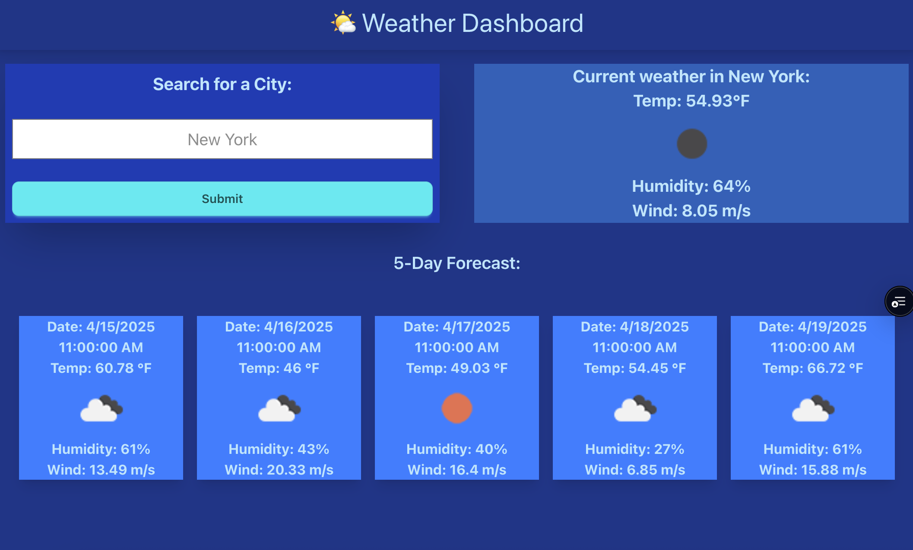

# Weather-Dashboard-React

## Description

The purpose of this project is to get weather data by borrowing openweather.com's weather API. Once a city is searched, the current weather and a 5 day forecast should appear.  Technologies used:  Nextjs, React, Node.

* Typing a city and clicking the search button should return the city's weather and 5 day forecast.

## Table of Contents

- [Description](#description)
- [Screenshots](#screenshots)
- [Installation](#installation)
- [Links](#links)
- [Contact Information](#contact)

## Screenshots

## Installation

 To install the packages that were used in this project please run the following command from the root:
 npm install and npm run develop, and npm run build to build the site for deployment .

## Links

Website:

https://weather-dashboard-react-eymtwk73n.vercel.app/

Repo: 

https://github.com/JGuzman87/weather-dashboard-react

## Contact 

Jorge Guzman
jguzman913@gmail.com